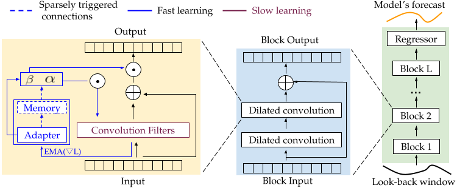

# Learning Fast and Slow for Online Time Series Forecasting

This project contains the Pytorch implementation of the following paper from Salesforce Research Asia: 

**Title:** [Learning Fast and Slow for Online Time Series Forecasting](https://arxiv.org/abs/2202.11672)

**Authors:** [Quang Pham](https://sites.google.com/view/quangpham93), [Chenghao Liu](https://sites.google.com/view/liuchenghao/home), [Doyen Sahoo](https://scholar.google.com.sg/citations?user=A61jJD4AAAAJ&hl=en), and [Steven Hoi](https://sites.google.com/view/stevenhoi/home)

## Introduction

Learning Fast and Slow for Online Time Series Forecasting introduces FSNet to forecast time series on the fly. FSNet augments the standard deep neural network (TCN in this repo) with the capabilities to quickly adapt to simultaneously deal with abrupt changing and repeating patterns in time series. Particularly, FSNet improves the slowly-learned backbone by dynamically balancing fast adaptation to recent changes and retrieving similar old knowledge. FSNet achieves this mechanism via an interaction between two complementary components of an adapter to monitor each layer's contribution to the lost, and an associative memory to support remembering, updating, and recalling repeating events.



## Requirements

- python == 3.7.3
- pytorch == 1.8.0
- matplotlib == 3.1.1
- numpy == 1.19.4
- pandas == 0.25.1
- scikit_learn == 0.21.3
- tqdm == 4.62.3
- einops == 0.4.0

## Benchmarking

### 1. Data preparation

We follow the same data formatting as the Informer repo (https://github.com/zhouhaoyi/Informer2020), which also hosts the raw data.
Please put all raw data (csv) files in the ```./data``` folder.

### 2. Run experiments

To replicate our results on the ETT, ECL, Traffic, and WTH datasets, run
```
chmod +x scripts/*.sh
bash .scripts/run.sh
```

### 3.  Arguments

**Method:** Our implementation supports the following training strategies:
- ogd: OGD training
- large: OGD training with a large backbone
- er: experience replay
- derpp: dark experience replay
- nomem: FSNET without the associative memory
- naive: FSNET without both the memory and adapter, directly trains the adaptation coefficients.
- fsnet: the proposed FSNet framework

You can specify one of the above method via the ```--method``` argument.

**Dataset:** Our implementation currently supports the following datasets: Electricity Transformer - ETT (including ETTh1, ETTh2, ETTm1, and ETTm2), ECL, Traffic, and WTH. You can specify the dataset via the ```--data``` argument.

**Other arguments:** Other useful arguments for experiments are:
- ```--test_bsz```: batch size used for testing: must be set to **1** for online learning,
- ```--seq_len```: look-back windows' length, set to **60** by default,
- ```--pred_len```: forecast windows' length, set to **1** for online learning.


 


